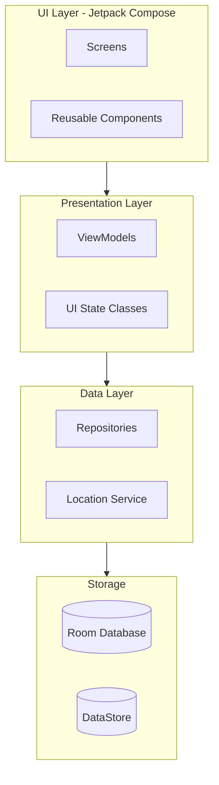
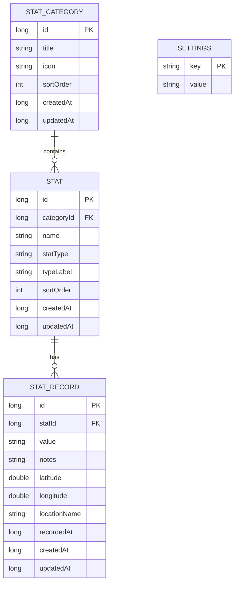
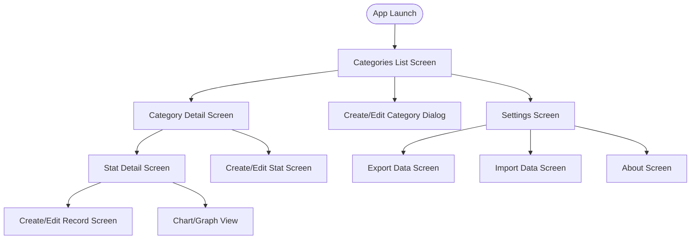
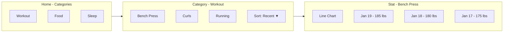

# Human Game Stats - Architecture Design Document

## 1. Project Overview

**App Name:** Human Game Stats  
**Platform:** Native Android  
**Language:** Kotlin  
**UI Framework:** Jetpack Compose  
**Minimum SDK:** API 26 (Android 8.0 Oreo)  
**Target SDK:** API 34 (Android 14)

### Core Features
- Create, edit, and delete Stat Categories (e.g., "Workout", "Food")
- Create, edit, and delete Stats within categories (e.g., "Bench Press", "Curls")
- Configurable stat types: Number, Time Duration, 1-5 Rating, Checkbox
- Record entries with automatic date/time and geo-location capture
- Sorting and filtering of stats and records
- Charts/graphs for trend visualization
- Export/Import data (CSV/JSON)
- Local-first storage with Room database

---

## 2. Technology Stack

| Component | Technology | Purpose |
|-----------|------------|---------|
| UI Framework | Jetpack Compose | Modern declarative UI |
| Architecture | MVVM (Simplified) | ViewModels → Repositories → Database |
| Database | Room | Local SQLite persistence |
| Settings | DataStore Preferences | App settings storage |
| Navigation | Navigation Compose | Screen navigation |
| DI | Hilt | Dependency injection |
| Async | Kotlin Coroutines + Flow | Reactive data streams |
| Location | FusedLocationProviderClient | Geo-location capture |
| Charts | MPAndroidChart or Vico | Data visualization |
| Serialization | Kotlinx Serialization | JSON export/import |

---

## 3. Architecture Overview

This app uses a **simplified MVVM architecture** where ViewModels interact directly with Repositories, avoiding unnecessary abstraction layers.



---

## 4. Data Model

### Entity Relationship Diagram



### Stat Types Enum

| Type | Description | Value Storage | Example |
|------|-------------|---------------|---------|
| `NUMBER` | Numeric value with custom label | Decimal string | "185.5" (Weight: 185.5 lbs) |
| `DURATION` | Time duration | Milliseconds as string | "3600000" (1 hour) |
| `RATING` | Selection 1-5 | Integer string | "4" |
| `CHECKBOX` | Boolean value | "true" or "false" | "true" |

---

## 5. Navigation Flow



### Screen Descriptions

| Screen | Purpose |
|--------|---------|
| **Categories List** | Home screen showing all stat categories with swipe-to-switch |
| **Category Detail** | Shows all stats in selected category with sorting options |
| **Stat Detail** | Shows all records for a stat with chart visualization |
| **Create/Edit Category** | Modal dialog for category management |
| **Create/Edit Stat** | Full screen for stat configuration including type selection |
| **Create/Edit Record** | Screen for entering stat data with auto-captured fields |
| **Settings** | App preferences, export/import, about |

---

## 6. Project Structure

```
app/
├── src/
│   └── main/
│       ├── java/com/humangamestats/
│       │   ├── HumanGameStatsApp.kt          # Application class
│       │   ├── MainActivity.kt                # Single activity
│       │   │
│       │   ├── data/
│       │   │   ├── database/
│       │   │   │   ├── AppDatabase.kt
│       │   │   │   ├── dao/
│       │   │   │   │   ├── StatCategoryDao.kt
│       │   │   │   │   ├── StatDao.kt
│       │   │   │   │   └── StatRecordDao.kt
│       │   │   │   └── entity/
│       │   │   │       ├── StatCategoryEntity.kt
│       │   │   │       ├── StatEntity.kt
│       │   │   │       └── StatRecordEntity.kt
│       │   │   ├── datastore/
│       │   │   │   └── SettingsDataStore.kt
│       │   │   ├── repository/
│       │   │   │   ├── StatCategoryRepository.kt
│       │   │   │   ├── StatRepository.kt
│       │   │   │   ├── StatRecordRepository.kt
│       │   │   │   └── SettingsRepository.kt
│       │   │   └── service/
│       │   │       └── LocationService.kt
│       │   │
│       │   ├── model/
│       │   │   ├── StatCategory.kt
│       │   │   ├── Stat.kt
│       │   │   ├── StatRecord.kt
│       │   │   ├── StatType.kt
│       │   │   └── SortOption.kt
│       │   │
│       │   ├── ui/
│       │   │   ├── navigation/
│       │   │   │   ├── NavGraph.kt
│       │   │   │   └── Screen.kt
│       │   │   ├── theme/
│       │   │   │   ├── Color.kt
│       │   │   │   ├── Theme.kt
│       │   │   │   └── Type.kt
│       │   │   ├── components/
│       │   │   │   ├── StatCard.kt
│       │   │   │   ├── RecordItem.kt
│       │   │   │   ├── StatTypeSelector.kt
│       │   │   │   ├── SortingMenu.kt
│       │   │   │   └── ChartComponents.kt
│       │   │   └── screens/
│       │   │       ├── categories/
│       │   │       │   ├── CategoriesScreen.kt
│       │   │       │   ├── CategoriesViewModel.kt
│       │   │       │   └── CategoryDialog.kt
│       │   │       ├── category_detail/
│       │   │       │   ├── CategoryDetailScreen.kt
│       │   │       │   └── CategoryDetailViewModel.kt
│       │   │       ├── stat/
│       │   │       │   ├── StatDetailScreen.kt
│       │   │       │   ├── StatDetailViewModel.kt
│       │   │       │   └── StatFormScreen.kt
│       │   │       ├── record/
│       │   │       │   └── RecordFormScreen.kt
│       │   │       └── settings/
│       │   │           ├── SettingsScreen.kt
│       │   │           ├── SettingsViewModel.kt
│       │   │           └── ExportImportScreen.kt
│       │   │
│       │   └── di/
│       │       ├── AppModule.kt
│       │       ├── DatabaseModule.kt
│       │       └── RepositoryModule.kt
│       │
│       ├── res/
│       │   ├── values/
│       │   │   ├── strings.xml
│       │   │   └── themes.xml
│       │   └── drawable/
│       │
│       └── AndroidManifest.xml
│
├── build.gradle.kts (app)
└── build.gradle.kts (project)
```

---

## 7. Database Schema

### Room Database Location
The database will be stored at:
```
/data/data/com.humangamestats/databases/human_game_stats.db
```

### Settings Storage
Settings will be stored using DataStore Preferences at:
```
/data/data/com.humangamestats/datastore/settings.preferences_pb
```

---

## 8. Key Implementation Details

### 8.1 Stat Type Implementation

```kotlin
enum class StatType(val displayName: String) {
    NUMBER("Number"),
    DURATION("Duration"),
    RATING("Rating (1-5)"),
    CHECKBOX("Checkbox")
}

data class Stat(
    val id: Long,
    val categoryId: Long,
    val name: String,
    val statType: StatType,
    val typeLabel: String,  // e.g., "Weight", "Reps", "Hours"
    val sortOrder: Int,
    val createdAt: Long,
    val updatedAt: Long
)
```

### 8.2 Geo-Location Capture

```kotlin
data class LocationData(
    val latitude: Double,
    val longitude: Double,
    val locationName: String?  // Reverse geocoded address
)

// Location will be captured automatically when creating a record
// User can disable this in settings
```

### 8.3 Sorting Options

| Sort Type | Description |
|-----------|-------------|
| `RECENT` | By most recent record entry |
| `OLDEST` | By oldest record entry |
| `HIGHEST` | By highest numeric value (NUMBER type only) |
| `LOWEST` | By lowest numeric value (NUMBER type only) |
| `ALPHABETICAL` | By stat name A-Z |
| `CUSTOM` | Manual sort order |

### 8.4 Export/Import Formats

**JSON Export Structure:**
```json
{
  "version": 1,
  "exportedAt": "2026-01-19T04:30:00Z",
  "categories": [
    {
      "id": 1,
      "title": "Workout",
      "icon": "fitness",
      "stats": [
        {
          "id": 1,
          "name": "Bench Press",
          "statType": "NUMBER",
          "typeLabel": "Weight",
          "records": [
            {
              "id": 1,
              "value": "185.5",
              "notes": "Felt strong today",
              "latitude": 32.7767,
              "longitude": -96.7970,
              "recordedAt": "2026-01-19T10:30:00Z"
            }
          ]
        }
      ]
    }
  ]
}
```

---

## 9. Dependencies (build.gradle.kts)

```kotlin
dependencies {
    // Core
    implementation("androidx.core:core-ktx:1.12.0")
    implementation("androidx.lifecycle:lifecycle-runtime-ktx:2.7.0")
    
    // Compose
    implementation(platform("androidx.compose:compose-bom:2024.01.00"))
    implementation("androidx.compose.ui:ui")
    implementation("androidx.compose.ui:ui-graphics")
    implementation("androidx.compose.ui:ui-tooling-preview")
    implementation("androidx.compose.material3:material3")
    implementation("androidx.activity:activity-compose:1.8.2")
    implementation("androidx.navigation:navigation-compose:2.7.6")
    
    // Room
    implementation("androidx.room:room-runtime:2.6.1")
    implementation("androidx.room:room-ktx:2.6.1")
    ksp("androidx.room:room-compiler:2.6.1")
    
    // DataStore
    implementation("androidx.datastore:datastore-preferences:1.0.0")
    
    // Hilt
    implementation("com.google.dagger:hilt-android:2.50")
    ksp("com.google.dagger:hilt-compiler:2.50")
    implementation("androidx.hilt:hilt-navigation-compose:1.1.0")
    
    // Location
    implementation("com.google.android.gms:play-services-location:21.1.0")
    
    // Charts (Vico - Compose-native)
    implementation("com.patrykandpatrick.vico:compose-m3:1.13.1")
    
    // Serialization
    implementation("org.jetbrains.kotlinx:kotlinx-serialization-json:1.6.2")
}
```

---

## 10. Permissions Required

```xml
<uses-permission android:name="android.permission.ACCESS_FINE_LOCATION" />
<uses-permission android:name="android.permission.ACCESS_COARSE_LOCATION" />
<uses-permission android:name="android.permission.WRITE_EXTERNAL_STORAGE" 
    android:maxSdkVersion="28" />
```

---

## 11. UI Mockup Flow



---

## 12. Implementation Phases

### Phase 1: Foundation
- Project setup with Gradle configuration
- Room database with all entities
- Basic navigation structure
- Theme and styling

### Phase 2: Core Features
- Categories management UI
- Stats management with type selection
- Records entry with auto-captured timestamp/location

### Phase 3: Advanced Features
- Sorting and filtering
- Charts and visualization
- Export/Import functionality
- Settings screen

### Phase 4: Polish
- Error handling
- UI polish and animations
- Testing

---

## 13. Settings Options

| Setting | Type | Default | Description |
|---------|------|---------|-------------|
| `auto_capture_location` | Boolean | true | Capture GPS on record creation |
| `default_sort_order` | Enum | RECENT | Default sorting for stats |
| `theme_mode` | Enum | SYSTEM | Light/Dark/System theme |
| `date_format` | String | "MMM dd, yyyy" | Date display format |
| `export_format` | Enum | JSON | Preferred export format |
