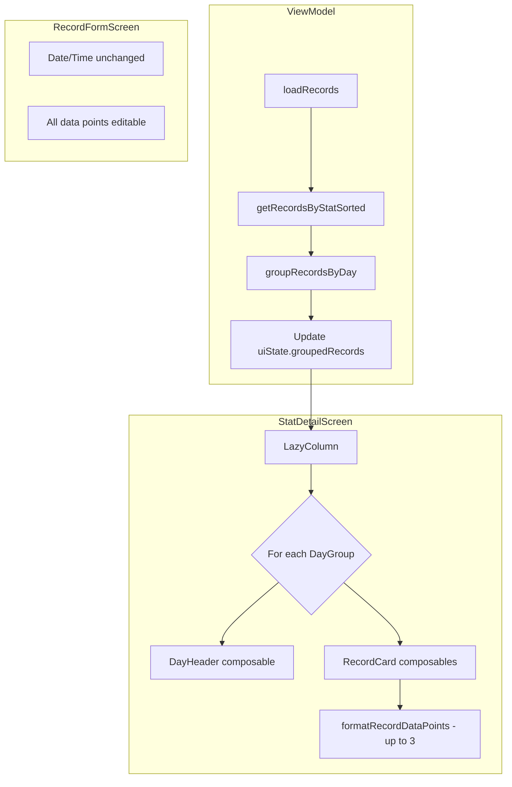

# Stat Record Display Improvements Plan

## Overview

This plan covers three main improvements to the stat record display on the StatDetailScreen:

1. Show up to 3 data points on record cards (instead of just 1)
2. Remove date/time from record cards (keep in add/edit forms)
3. Group records by the day they were entered

## Current State Analysis

### Files to Modify

| File | Purpose |
|------|---------|
| [`StatDetailScreen.kt`](../app/src/main/java/com/humangamestats/ui/screens/stat/StatDetailScreen.kt) | Main screen displaying records - contains `RecordCard` composable |
| [`StatDetailViewModel.kt`](../app/src/main/java/com/humangamestats/ui/screens/stat/StatDetailViewModel.kt) | ViewModel - needs to provide grouped records |

### Files to Keep Unchanged

| File | Reason |
|------|--------|
| [`RecordFormScreen.kt`](../app/src/main/java/com/humangamestats/ui/screens/record/RecordFormScreen.kt) | Already has date/time selection - must remain |
| [`StatRecord.kt`](../app/src/main/java/com/humangamestats/model/StatRecord.kt) | Model unchanged, already has `formatValuesForDisplay()` method |

## Implementation Details

### 1. RecordCard Data Points Display

**Current Implementation** (lines 352-364 in StatDetailScreen.kt):
```kotlin
// Value
Column(modifier = Modifier.weight(1f)) {
    Text(
        text = formatRecordValue(record.value, stat?.statType ?: StatType.NUMBER),
        style = MaterialTheme.typography.headlineMedium,
        color = typeColor
    )
    Text(
        text = stat?.typeLabel ?: "",
        style = MaterialTheme.typography.bodySmall,
        color = MaterialTheme.colorScheme.onSurfaceVariant
    )
}
```

**New Implementation**:
- Display up to 3 data points inline with pipe separator
- Use existing `formatValuesForDisplay()` method from `StatRecord` but limit to 3
- Format: `135 lbs | 10 reps | 3 sets`

```kotlin
// Values - show up to 3 data points
Column(modifier = Modifier.weight(1f)) {
    val displayValues = formatRecordDataPoints(
        record = record,
        dataPoints = stat?.dataPoints ?: emptyList(),
        maxPoints = 3
    )
    Text(
        text = displayValues,
        style = MaterialTheme.typography.titleMedium,
        color = typeColor
    )
}
```

**New Helper Function**:
```kotlin
private fun formatRecordDataPoints(
    record: StatRecord,
    dataPoints: List<DataPoint>,
    maxPoints: Int = 3
): String {
    val pointsToShow = dataPoints.take(maxPoints)
    return pointsToShow.mapIndexed { index, dp ->
        val value = record.getValueAt(index) ?: ""
        when (dp.type) {
            StatType.NUMBER -> {
                val num = value.toDoubleOrNull()
                val formatted = if (num != null) {
                    if (num == num.toLong().toDouble()) num.toLong().toString()
                    else String.format("%.2f", num)
                } else value
                if (dp.unit.isNotEmpty()) "$formatted ${dp.unit}" else formatted
            }
            StatType.DURATION -> StatRecord.formatDuration(value.toLongOrNull() ?: 0L)
            StatType.RATING -> "★".repeat(value.toIntOrNull() ?: 0) + "☆".repeat(5 - (value.toIntOrNull() ?: 0))
            StatType.CHECKBOX -> if (value == "true") "✓" else "✗"
        }
    }.filter { it.isNotEmpty() }.joinToString(" | ")
}
```

### 2. Remove Date/Time from RecordCard

**Remove** the following section from `RecordCard` (lines 366-377):
```kotlin
// Date/Time
Column(horizontalAlignment = Alignment.End) {
    Text(
        text = record.getFormattedDate(),
        style = MaterialTheme.typography.bodyMedium
    )
    Text(
        text = record.getFormattedTime(),
        style = MaterialTheme.typography.bodySmall,
        color = MaterialTheme.colorScheme.onSurfaceVariant
    )
}
```

The date information will now be shown in the day group headers instead.

### 3. Group Records by Day

#### 3.1 Add Data Class for Grouped Records

Add to `StatDetailViewModel.kt`:
```kotlin
/**
 * Represents a group of records for a single day.
 */
data class DayGroup(
    val date: Long, // Start of day timestamp
    val displayDate: String, // Formatted display string
    val records: List<StatRecord>
)
```

#### 3.2 Update StatDetailUiState

```kotlin
data class StatDetailUiState(
    val stat: Stat? = null,
    val records: List<StatRecord> = emptyList(),
    val groupedRecords: List<DayGroup> = emptyList(), // NEW
    val chartData: List<StatRecord> = emptyList(),
    // ... rest unchanged
)
```

#### 3.3 Add Grouping Logic to ViewModel

```kotlin
/**
 * Group records by day and format with relative dates.
 */
private fun groupRecordsByDay(records: List<StatRecord>): List<DayGroup> {
    val today = Calendar.getInstance().apply {
        set(Calendar.HOUR_OF_DAY, 0)
        set(Calendar.MINUTE, 0)
        set(Calendar.SECOND, 0)
        set(Calendar.MILLISECOND, 0)
    }.timeInMillis
    
    val yesterday = today - 86400000L // 24 hours in millis
    
    return records
        .groupBy { record ->
            Calendar.getInstance().apply {
                timeInMillis = record.recordedAt
                set(Calendar.HOUR_OF_DAY, 0)
                set(Calendar.MINUTE, 0)
                set(Calendar.SECOND, 0)
                set(Calendar.MILLISECOND, 0)
            }.timeInMillis
        }
        .map { (dayStart, dayRecords) ->
            val displayDate = when {
                dayStart >= today -> "Today"
                dayStart >= yesterday -> "Yesterday"
                else -> SimpleDateFormat("MMM d, yyyy", Locale.getDefault())
                    .format(Date(dayStart))
            }
            DayGroup(dayStart, displayDate, dayRecords)
        }
        .sortedByDescending { it.date }
}
```

#### 3.4 Update loadRecords to Populate groupedRecords

Modify the `loadRecords()` function to also populate `groupedRecords`:

```kotlin
.onEach { records ->
    _uiState.update { state ->
        state.copy(
            records = records,
            groupedRecords = groupRecordsByDay(records), // NEW
            isLoading = false,
            error = null
        )
    }
}
```

### 4. Create DayHeader Composable

Add to `StatDetailScreen.kt`:
```kotlin
@Composable
private fun DayHeader(
    displayDate: String,
    recordCount: Int,
    modifier: Modifier = Modifier
) {
    Row(
        modifier = modifier
            .fillMaxWidth()
            .padding(vertical = 8.dp),
        verticalAlignment = Alignment.CenterVertically
    ) {
        Text(
            text = displayDate,
            style = MaterialTheme.typography.titleMedium,
            color = MaterialTheme.colorScheme.primary
        )
        Spacer(modifier = Modifier.width(8.dp))
        Text(
            text = "($recordCount)",
            style = MaterialTheme.typography.bodySmall,
            color = MaterialTheme.colorScheme.onSurfaceVariant
        )
    }
}
```

### 5. Update LazyColumn to Use Grouped Records

Replace the current flat `items()` list with grouped sections:

```kotlin
// Records list grouped by day
uiState.groupedRecords.forEach { dayGroup ->
    item(key = "header_${dayGroup.date}") {
        DayHeader(
            displayDate = dayGroup.displayDate,
            recordCount = dayGroup.records.size
        )
    }
    
    items(
        items = dayGroup.records,
        key = { it.id }
    ) { record ->
        RecordCard(
            record = record,
            stat = uiState.stat,
            onEditClick = { onEditRecordClick(record.id) },
            onDeleteClick = { viewModel.showDeleteConfirmation(record) }
        )
    }
}
```

## Visual Mockup

### Before
```
┌─────────────────────────────────────┐
│ 135              Jan 21, 2026       │
│ Weight           5:30 PM     [✏][🗑]│
│                                     │
│ Great workout session               │
└─────────────────────────────────────┘
```

### After
```
Today (3)
┌─────────────────────────────────────┐
│ 135 lbs | 10 reps | 3 sets   [✏][🗑]│
│                                     │
│ Great workout session               │
└─────────────────────────────────────┘

Yesterday (2)
┌─────────────────────────────────────┐
│ 130 lbs | 8 reps | 3 sets    [✏][🗑]│
└─────────────────────────────────────┘

Jan 19, 2026 (1)
┌─────────────────────────────────────┐
│ 125 lbs | 12 reps | 2 sets   [✏][🗑]│
└─────────────────────────────────────┘
```

## Architecture Diagram



## Testing Checklist

- [ ] Record cards show up to 3 data points with pipe separator
- [ ] Single data point stats still display correctly
- [ ] Date/time no longer appears on record cards
- [ ] Date/time still works in add record form
- [ ] Date/time still works in edit record form
- [ ] Records are grouped by day correctly
- [ ] Today and Yesterday labels show for recent records
- [ ] Older dates show abbreviated format (Jan 21, 2026)
- [ ] Day headers show record count
- [ ] Sort options still work within day groups
- [ ] Chart functionality unchanged
- [ ] Statistics summary unchanged
